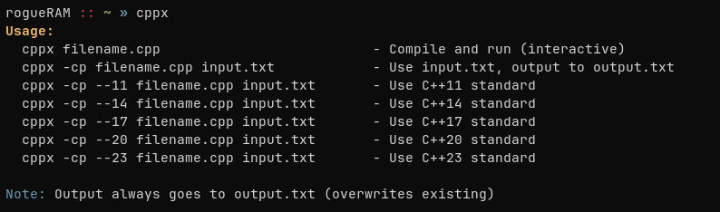

# cppx - compile and execute c++ programs 

## Clone the repository
```bash
git clone https://github.com/yourusername/cppx.git
cd cppx
```
## Make the script executable
```bash
chmod +x cppx
```
## Move to system path (linux)
```bash
sudo mv cppx /usr/local/bin/
```
## Verify Installation
```bash
cppx
```


