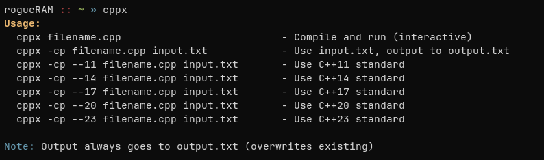

# Compile and Execute C++ Programs 
### Clone the repository
```bash
git clone https://github.com/yourusername/cppx.git
cd cppx
```
### Make the script executable
```bash
chmod +x cppx
```
### Move to system path (linux)
```bash
sudo mv cppx /usr/local/bin/
```
### Verify Installation
```bash
cppx
```


### Windows Setup
cppx is a Bash script, so on Windows you'll need a Bash-compatible shell: **[Git Bash](https://git-scm.com/downloads/win)** (comes with Git for Windows) or **[WSL](https://learn.microsoft.com/en-us/windows/wsl/install)**. You'll also need a C++ compiler on your PATH — install one of:
- **[MinGW-w64 (g++)](https://www.mingw-w64.org/downloads/)** — matches the compiler cppx calls by default
- **[Clang for Windows](https://clang.llvm.org/get_started.html)** — alternative compiler, works if you alias/symlink g++ to clang++
> *Note:* If you use WSL instead, just follow the [Linux instructions](#move-to-system-path-linux) above inside your WSL shell.
